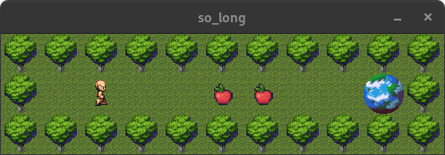

*This project has been created as part of the 42 curriculum by mobouifr.*

# so_long
### A tiny 2D tile game built in C with MiniLibX.


## Screenshot



---

## Description

`so_long` is one of the first graphical projects in the 42 core curriculum. The concept is simple: read a map from a `.ber` file, validate it, render it as tiles, and let the player collect all collectibles before reaching the exit.

Under the hood it is a clean introduction to practical engine fundamentals — no game framework, no physics library, no shortcuts. Just C, file descriptors, and MLX.

- Parsing and validating level files
- Managing dynamic memory for map storage
- Handling keyboard input and event hooks
- Rendering sprite tiles in a loop with MiniLibX
- Compositing each tile from the floor image first so overlays stay consistent on macOS and Linux
- Enforcing gameplay rules: collision, collectible tracking, win condition

---

## Gameplay

| Symbol | Meaning |
|---|---|
| `1` | Wall — blocks movement |
| `0` | Floor — walkable |
| `P` | Player spawn (exactly one) |
| `C` | Collectible (at least one) |
| `E` | Exit (exactly one) |

**To win:** collect every `C` tile, then step on `E`. The player cannot walk through walls. The move count is printed to the terminal after each valid move.

---

## Features

| Feature | Status | Notes |
|---|---|---|
| `.ber` map loading | ✓ | Line-by-line via `get_next_line` |
| Rectangular map check | ✓ | Every row must have equal width |
| Character validation | ✓ | Only `1`, `0`, `P`, `C`, `E` accepted |
| Required entity counts | ✓ | Exactly 1 `P`, exactly 1 `E`, at least 1 `C` |
| Border wall validation | ✓ | Outer frame must be walls |
| Playability check | ✓ | Flood fill verifies all collectibles and exit are reachable |
| Tile rendering with XPM | ✓ | Wall, floor, player, collectible, exit |
| Movement + collision | ✓ | Arrow keys move when target tile is valid |
| Win condition + clean exit | ✓ | Exit only works after all collectibles collected |
| ESC / window-close exit | ✓ | Both call the shutdown routine cleanly |

---

## Controls

| Key | Action |
|---|---|
| `↑` | Move up |
| `↓` | Move down |
| `←` | Move left |
| `→` | Move right |
| `ESC` | Quit |

> Keycodes used: Up `126` · Down `125` · Left `123` · Right `124` · ESC `53`
> These are standard macOS MiniLibX keycodes.

---

## Map format

```
11111111111
10P00CC00E1
11111111111
```

**Rules:**
- File extension must be `.ber`
- Map must be rectangular — every row the same width
- Map must be fully enclosed by walls
- Exactly one player spawn `P`
- Exactly one exit `E`
- At least one collectible `C`
- Any other character causes a parse error

---

## Project structure

```
so_long/
├── Makefile
├── so_long.h                    # main header — structs and prototypes
├── so_long.c                    # entry point and game loop
├── so_long_utils_00.c           # map loading and memory management
├── so_long_utils_01.c           # validation helpers
├── so_long_utils_02.c           # rendering and tile drawing
├── so_long_utils_03.c           # movement and collision
├── so_long_mvp_utils.c          # flood fill and playability check
├── ft_putnbr_nl.c               # move counter output
├── get_next_line/               # line reader used by the parser
├── maps/                        # .ber level files
├── textures/                    # XPM sprite assets
├── minilibx-linux/              # MiniLibX Linux port (X11)
├── minilibx_macos_opengl/       # MiniLibX macOS OpenGL port
└── minilibx_macos_metal/        # MiniLibX macOS Metal port (Apple Silicon)
```

---

## Getting started

### macOS

```bash
make
./so_long maps/map.ber
```

### Linux

Install dependencies first:

```bash
sudo apt-get install gcc make xorg libxext-dev libbsd-dev
```

Then build manually:

```bash
cd minilibx-linux && sh ./configure && cd ..

cc -Wall -Wextra -Werror -Iminilibx-linux \
  so_long.c so_long_utils_00.c so_long_utils_01.c \
  so_long_utils_02.c so_long_utils_03.c \
  so_long_mvp_utils.c ft_putnbr_nl.c \
  get_next_line/get_next_line.c \
  get_next_line/get_next_line_utils.c \
  -Lminilibx-linux -lmlx -L/usr/lib -lXext -lX11 -lm -lbsd \
  -o so_long

./so_long maps/map.ber
```

> The top-level Makefile currently links with `-framework OpenGL -framework AppKit` (macOS only). The Linux compile above is the manual equivalent until the Makefile is unified.

> Always launch from the project root — texture paths are relative (`textures/*.xpm`).

> Tile rendering is done by compositing the floor into an in-memory tile image first, then overlaying walls, collectibles, exit, or player sprites. This avoids relying on MiniLibX XPM transparency differences between macOS and Linux.

---

## Resources

- [MiniLibX documentation](https://harm-smits.github.io/42docs/libs/minilibx)
- `man 2 open` · `man 2 read` · `man 2 close`
- `man 3 malloc` · `man 3 free`
- 42 so_long subject guidelines